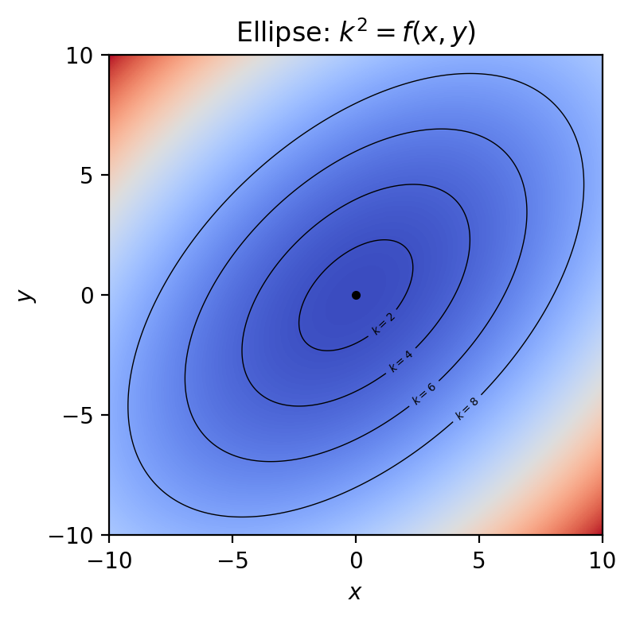

# Testbild


# Beweisbild


```python
from matplotlib import pyplot as plt
import numpy as np
# Grid
ndot = 1000j
width = 10
x1 = np.r_[-width:width:ndot]
x2 = np.r_[-width:width:ndot]
X1,X2 = np.meshgrid(x1,x2)
## Berechnung der Skalarfunktion: Ellipse
# Parameter
a,b,c = 1,1,-0.5
Z = (a*X1**2 + 2*c*X1*X2 + b*X2**2)
#
plt.figure(figsize=(4,4),dpi=200,facecolor='white')
# skalarfeld
plt.pcolormesh(X1,X2,Z,cmap=plt.cm.coolwarm,antialiased=False,shading='auto')
# konturen
k2 = np.r_[0:9:2]**2
contours = plt.contour(X1,X2,Z,k2,colors='k',antialiased=True,linewidths=0.5)
fmt = {i:f"$k={i**0.5:2.0f}$" for i in k2}
plt.clabel(contours,inline=True,fontsize=5,fmt=fmt,colors='k')
# Zentrum
plt.plot(0,0,'ko',ms=3.0)
#
#plt.grid(1)
plt.xticks(np.r_[-width:width:5j])
plt.yticks(np.r_[-width:width:5j])
plt.xlabel('$x$')
plt.ylabel('$y$')
plt.title(r'Ellipse: $k^2=f(x,y)$')
#
plt.show()
```
